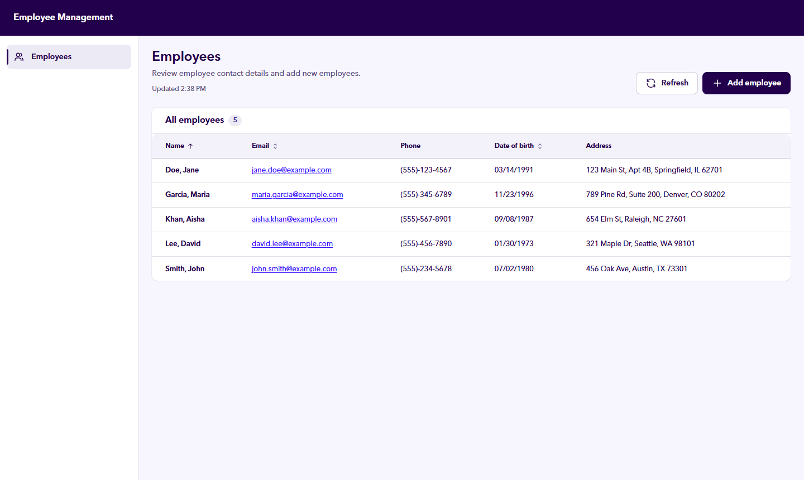
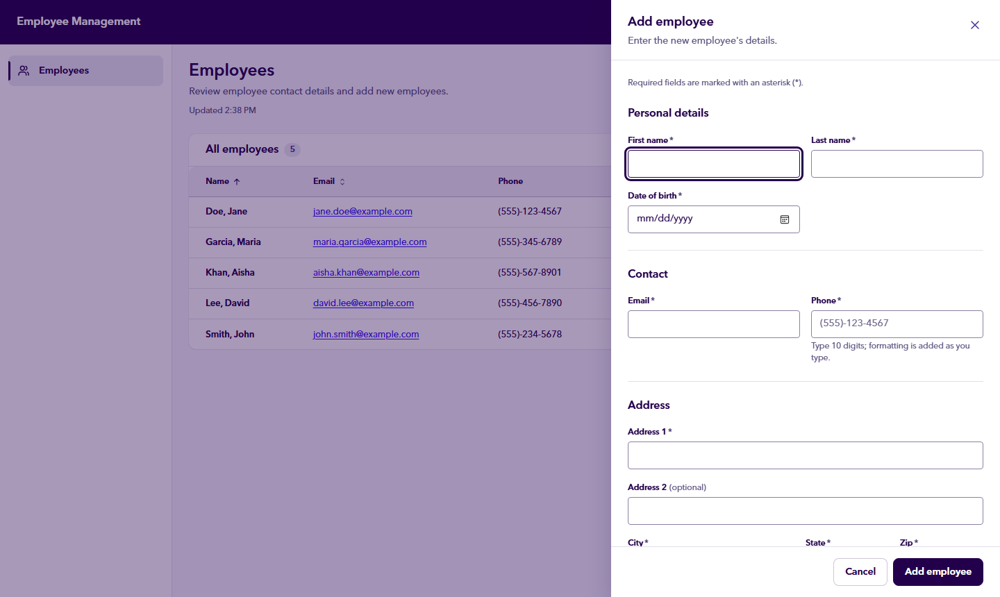

# Employee Management

[](https://github.com/dawsonarmstrongg/employee-management-dotnet/actions/workflows/build-and-test.yml)

Employee management app built with .NET 10, ASP.NET Core Web API, Blazor WebAssembly, EF Core (Code First) and SQLite. A REST API (documented with Swagger) lists, creates, updates and deletes employees and their addresses; a Blazor page shows the employees in a table and adds new ones with field-level validation.

Quick start: `dotnet run --project src/EmployeeManagement.Server`, then open `http://localhost:5233`. The database is created and seeded on first run.



<details>
<summary>Add employee form</summary>



</details>

## Prerequisites

- [.NET 10 SDK](https://dotnet.microsoft.com/download/dotnet/10.0) (pinned via `global.json`)
- No database install needed — on startup the app applies EF Core migrations, which create `src/EmployeeManagement.Server/employees.db` and insert 5 seed employees. Delete that file to reset the data.

## Build, run, test

```powershell
dotnet restore
dotnet build
dotnet run --project src/EmployeeManagement.Server
dotnet test
```

- UI: the URL printed by `dotnet run` (e.g. `http://localhost:5233`)
- VS Code: press **F5** and pick **Run Server (C# Dev Kit)** (or the `coreclr` fallback) from `.vscode/launch.json`. `Ctrl+Shift+B` builds; the `watch` task runs `dotnet watch`.
- Swagger UI: `http://localhost:5233/swagger` (Development only; the raw OpenAPI document is at `/openapi/v1.json`)

## API

| Method | Route | Success | Errors |
|---|---|---|---|
| GET | `/api/employees` | 200 list (sorted by last, first name) | — |
| GET | `/api/employees/{id}` | 200 | 404 |
| POST | `/api/employees` | 201 + `Location` header | 400 validation, 409 duplicate email |
| PUT | `/api/employees/{id}` | 200 updated employee | 400, 404, 409 |
| DELETE | `/api/employees/{id}` | 204 (address deleted by cascade) | 404 |

Errors use the standard problem details JSON format (`application/problem+json`, RFC 9457); 400 responses list messages per field (for example `Address.Zip`). Every error under `/api` is JSON, including ones the framework produces before our code runs (an unknown route or `/api/employees/abc` → 404, an unsupported method → 405, malformed JSON → 400).

## Solution layout

| Project | Purpose |
|---|---|
| `src/EmployeeManagement.Server` | Single host: REST API, EF Core + SQLite, serves the Blazor client |
| `src/EmployeeManagement.Client` | Blazor WebAssembly UI — talks to the API over HTTP only |
| `src/EmployeeManagement.Contracts` | Request/response DTOs shared by API and UI |
| `tests/EmployeeManagement.Tests` | xUnit unit, API integration and Blazor component tests (see [Tests](#tests)) |

The Client project has no reference to the Server project or EF Core, so the UI *cannot* access the database directly — the "UI goes through the API" rule is enforced by the project graph.

## Tests

`dotnet test` runs 98 tests (159 cases, because a `[Theory]` runs once per row of test data) in about 2 seconds once built. Nothing else needs to be installed or running.

| Folder | What it covers | How |
|---|---|---|
| `Unit/` | Validation rules and their edge cases, input normalization, phone formatting while typing, state filtering, table sorting, and the combined Name/Address text | Plain xUnit; no web server or database |
| `Integration/` | Every endpoint and status code, nested addresses, duplicate email in any letter case, cascade delete, problem details errors, Swagger | `WebApplicationFactory` runs the real app in memory, with migrations and seed data, against its own temporary SQLite file that is deleted afterwards, so `employees.db` is never touched |
| `Components/` | The add form (separate fields, required and phone messages, a 409 shown under Email, server unreachable) and the employee table | bUnit renders the Blazor components without a browser; a fake `HttpMessageHandler` stands in for the API |

Each test is tagged with the requirement it checks, for example `[Trait("Requirement", "R-04")]`, so you can run one area at a time: `dotnet test --filter "Requirement=R-17"` runs only the phone-formatting tests. A tag on a test class applies to all of its tests, so `EmployeeRequestValidatorTests`, which covers every field rule, carries R-02 to R-09 and R-28.

| ID | Requirement |
|---|---|
| R-01 | List all employees |
| R-02 | First and last name required |
| R-03 | Email required and unique (in any letter case) |
| R-04 | Phone required, in `(XXX)-XXX-XXXX` format |
| R-05 | Address 1 required |
| R-06 | Address 2 optional |
| R-07 | City required |
| R-08 | State is a 2-letter US code |
| R-09 | ZIP is 5 digits |
| R-10 | Seed data (3 to 5 employees) and input normalization |
| R-11 | Address nested in create, update and get; delete removes it too |
| R-12 | Status codes |
| R-13 | OpenAPI / Swagger |
| R-14 | Problem details errors |
| R-15 | Table columns and combined values |
| R-16 | Table sorting |
| R-17 | Phone number formats while typing |
| R-18 | State picker |
| R-19 | Add form fields and error messages |
| R-28 | Date of birth (replaces age) and its valid range |

R-20 to R-27 were checked by reading the code or running the app rather than by automated tests: dependency injection, the mix of unit and integration tests, the README and AI_USAGE documents, a fresh-clone run, one host for API and UI, the UI using only the API, and the database being created by Code First at startup.

## Architecture overview

One ASP.NET Core host (`Server`) serves both the REST API and the Blazor WebAssembly files. The UI runs in the browser and reaches the data only through the API.

```text
Browser: Blazor WebAssembly (Client)
  Employees page ─ EmployeeTable / AddEmployeeForm
        │  EmployeeApiClient (HttpClient, JSON)
        ▼
ASP.NET Core host (Server)
  EmployeeEndpoints   Minimal API: HTTP in, status code out
        ▼
  EmployeeService     normalize, validate, duplicate email, save (via IEmployeeService, DI)
        ▼
  AppDbContext        EF Core Code First
        ▼
  SQLite: employees.db (created, migrated and seeded at startup)

Contracts (shared by Client and Server): request/response types, validation rules, US states
```

Adding an employee, end to end:

1. The form runs the shared validation rules and shows any errors without calling the API.
2. `EmployeeApiClient` POSTs the request as JSON to `/api/employees`.
3. The endpoint passes it to `EmployeeService`, which normalizes it, runs the same validation and checks for a duplicate email.
4. The service saves the employee and address through EF Core and returns an outcome.
5. The endpoint turns that outcome into an HTTP response: 201, 400 (errors per field), or 409 (problem details).
6. The client adds the new employee to the table, or shows the errors next to the matching fields.

## Assumptions and technical decisions

- Blazor WebAssembly hosted by the API project, rather than Interactive Server, so the UI is a true API client.
- Host project renamed from the template default `Web` to `Server` so it pairs clearly with `Client` (Web suggested it might be the UI).
- **EF Core Code First with migrations** (`Data/Migrations`), applied automatically at startup via `Database.Migrate()`. Chosen over `EnsureCreated()` because migrations can evolve the schema later without dropping data.
- **Seed data via `HasData`**, so the 5 employees/addresses are part of the initial migration.
- **One-to-one Employee → Address**: `Addresses.EmployeeId` is a unique foreign key with `ON DELETE CASCADE`, so deleting an employee deletes their address in the database itself.
- **Case-insensitive unique email**: the `Email` column uses SQLite's `NOCASE` collation plus a unique index, so the database rejects `Jane@x.com` if `jane@x.com` exists. (NOCASE only folds ASCII letters — acceptable for email addresses here.)
- **Date of birth instead of age (deliberate deviation):** the spec's add form lists *age*. A stored age goes stale every birthday, so `Employee` stores `DateOfBirth` (`DateOnly`, saved as `yyyy-MM-dd` text in SQLite) and the form collects date of birth. Age can be calculated from it whenever it's needed. This was changed through a second migration (`ReplaceAgeWithDateOfBirth`) rather than editing the first one, so existing databases upgrade in place.
- **Contracts: separate input and output types.** `EmployeeDto`/`AddressDto` (responses) are immutable records. `EmployeeRequest`/`AddressRequest` (POST/PUT bodies) are mutable classes so the Blazor form can bind straight to them. Database entities never leave the Server project.
- **One request type for create and update.** POST and PUT take the same fields; PUT gets the employee id from the URL, so a separate `UpdateEmployeeRequest` would be an identical copy.
- **Validation rules live once, in Contracts** (DataAnnotations attributes), so the form and the API enforce the same rules. `EmployeeRequestValidator` runs them, including the nested address, because .NET's built-in `Validator` doesn't descend into nested objects. Errors come back keyed by field (`Email`, `Address.Zip`), the shape ASP.NET Core uses for a 400 validation response.
- **Validation details:** phone and ZIP use `[0-9]` rather than `\d` (in .NET, `\d` also matches non-ASCII digits); state must be one of the 50 state codes or DC, accepted in any case; date of birth must be between 1900-01-01 and today; email uses .NET's `[EmailAddress]` check, which is deliberately loose.
- **Minimal APIs** in a feature folder (`Server/Employees/`) rather than MVC controllers: less ceremony for five endpoints. Handlers return `TypedResults` with `Results<...>` return types, so Swagger reads most status codes from the method signature. 404 and 409 are sent with `TypedResults.Problem`, so they use the `application/problem+json` media type like the 400s; that result type doesn't carry a status code, so those routes list theirs with `.ProducesProblem(...)`.
- **Thin endpoints, rules in `EmployeeService`.** The endpoints only translate between HTTP and an `IEmployeeService` (registered in DI as scoped, like the `DbContext`). The service returns an outcome (`Success`, `ValidationFailed`, `NotFound`, `DuplicateEmail`) and knows nothing about HTTP, so it can be unit-tested directly.
- **Input is normalized before validation:** fields are trimmed, State is uppercased and a blank Address 2 becomes null. So `"  "` counts as missing, and `" tx"` is stored as `TX`.
- **Duplicate email gets two checks:** a query before saving gives a clean 409, and if two requests race past it, the unique index rejects the second insert, which is also mapped to 409.
- **PUT returns 200 with the updated employee** (not 204) so the client doesn't need a second GET.
- **Delete is a single SQL `DELETE`** (`ExecuteDeleteAsync`); the database's `ON DELETE CASCADE` removes the address.
- **Swagger UI only in Development**, which is what `dotnet run` and F5 use. It reads ASP.NET Core's built-in OpenAPI document instead of generating its own.
- **One page for the UI** (`Client/Pages/Employees.razor` at `/`): the employee table (`EmployeeTable`) and an **Add employee** button that opens the form (`AddEmployeeForm`) in a side drawer. Escape, Cancel, the × button and clicking outside all close the drawer, but if anything has been typed you are asked to confirm first. After a successful add the drawer closes, a message confirms it, and the new employee is inserted into the table (marked **New**) without reloading the list.
- **No prerendering.** The Blazor template prerenders pages on the server by default, which would make the page fetch its data on the server through a different code path. With `prerender: false` the UI runs only in the browser and every read and write goes through the API with `HttpClient`. The trade-off: the page shows nothing until the WebAssembly runtime has downloaded.
- **The form validates with the same code as the API.** A small custom validator (`EmployeeFormValidator`) runs the Contracts `EmployeeRequestNormalizer` + `EmployeeRequestValidator`, so the form and the API cannot disagree, and the nested address is validated too (Blazor's built-in `DataAnnotationsValidator` skips nested objects). Errors appear per field as you type and on submit; nothing is sent until the form is valid. Browser validation is turned off (`novalidate`) so the browser's own email check can't block the submit before these messages appear.
- **API errors appear next to the field they belong to.** The 400 error keys (`Email`, `Address.Zip`) are mapped onto the matching inputs, and a 409 duplicate email is shown under Email. If the server can't be reached, a general error message is shown instead.
- **Phone number formats as you type.** `InputPhoneNumber` reformats on every keystroke (`5551234567` → `(555)-123-4567`), ignores anything that isn't a digit, stops at 10 digits and handles pasted numbers such as `+1 (555) 222-3333`. It never adds a trailing separator, so Backspace always deletes a digit. The formatting logic is plain C# (`PhoneNumberFormatter`), so it can be unit tested. To avoid an error appearing after the first digit, the phone message waits until the number is complete or you leave the field; once shown, it clears as soon as the number is fixed. The API still validates the format, so the server never relies on the UI.
- **Normalization lives in Contracts** (`EmployeeRequestNormalizer`), shared by the API and the form.
- **State picker with type-to-filter.** `InputUsState` is a small combobox, not a native `<select>` or `<datalist>`: typing filters the list by code first, then by name (`T` → TN, TX; `TE` → Tennessee, Texas), and you can use the arrow keys, Enter, Escape (which closes only the list, not the drawer around it) or the mouse. Input is limited to two letters and uppercased. A `<select>` can't be typed into freely, and `<datalist>` filtering and appearance differ by browser. The list of states lives in `Contracts/Validation/UsStates.cs`, so the API validation and the picker share one list. A few lines of JavaScript (`InputUsState.razor.js`) stop Enter from submitting the form while an option is highlighted, because Blazor can't cancel a key press conditionally. Validation timing matches the phone field, and ARIA combobox attributes support screen readers.
- **Sorting only; names shown "Last, First".** Search, filtering and pagination are out of scope in the brief, so the table only sorts: click Name, Email or Date of birth to sort, click again to reverse. Name sorts by last name, then first name (the API's default order). Sorting happens in the browser on the list already loaded (`EmployeeSorter`); the sorted column is marked with `aria-sort` and the new order is announced to screen readers.
- **Extra Date of birth column (deliberate deviation):** the brief lists four table columns (Name, Email, Phone, Address). The table also shows Date of birth, so the value collected by the form (which replaced age) is visible after saving. It's easy to remove if the four-column list is meant strictly.
- **UI design system (extra; the brief says visual design isn't assessed).** The UI follows a Zelis "Lumen"-style design brief (summarized in `AI_USAGE.md`). Every color, font size, spacing step, corner radius, shadow and animation duration is a CSS variable in `Server/wwwroot/css/zelis-tokens.css`. `zelis-theme.css` maps Bootstrap onto those variables and defines the shared `zl-*` classes, so components don't use one-off colors. Reusable pieces live in `Client/Components/UI/`: `PageHeader`, `StatusChip`, `Alert`, `EmptyState`, `TableSkeleton`, `FormField`, `Dialog`, `Drawer`, `ConfirmDialog`, `ToastHost` (with `ToastService`) and `Icon`. No UI library was added: it's still Bootstrap, plain CSS and a few small JavaScript modules.
- **Responsive layout and designed states.** A 64px header with a 248px side menu on desktop, a 64px icon rail with tooltips on tablets, and a slide-out menu on phones; on narrow screens the table scrolls sideways instead of the whole page. Loading shows a skeleton table, an empty list shows an Add button, a failed load shows an error with **Try again**, and a failed refresh keeps the current list and shows an error message that stays until dismissed.
- **Accessibility (WCAG 2.2 AA target).** Everything works from the keyboard with a visible 3px focus ring and a skip link; focus moves into the drawer and back to the button that opened it; errors are linked to their fields and the first invalid field gets focus; loading, sorting and save messages are announced to screen readers; status is never shown by color alone; animation is turned off for users who prefer reduced motion. Checked with axe-core on every page and state at desktop, tablet and phone widths: 0 violations.
- **Static error page.** The server's `/Error` page is excluded from interactive routing (`[ExcludeFromInteractiveRouting]`) so it renders as plain HTML. Before, the WebAssembly router took over every page, so the error page could never appear.
- **Not built from the design brief:** dashboard cards, charts, tabs, breadcrumbs and overflow menus (a single page with one set of actions doesn't need them). There's no official Zelis logo file in the repo, so the header shows the app name and has an optional `LogoSrc` parameter for a real logo rather than a redrawn one. Avenir Next is a licensed font and isn't included; browsers without it use Segoe UI or Arial.
- **Pinned package versions** (no `10.*` wildcards) so a fresh clone restores exactly what was tested.
- **Continuous integration:** a GitHub Actions workflow (`.github/workflows/build-and-test.yml`) restores, builds and runs every test on Ubuntu and Windows for each push and pull request.

## Incomplete requirements

Every requirement in the brief is implemented. Deliberate differences from the brief:

- **Date of birth instead of age** on the form and in the database (see the decisions above for why).
- **The table shows a fifth column, Date of birth**, so the value from the form is visible after saving. The brief lists four columns; the column is easy to remove if that list is meant strictly.
- **No edit or delete screens in the UI.** The brief says they aren't required; update and delete are available in the API and can be tried in Swagger.

## What I'd improve with more time

- Browser end-to-end tests (Playwright) in the repo. The browser checks used during development ran from a throwaway environment outside the repo, so `dotnet test` doesn't need a browser installed.
- Edit and delete screens in the UI, using the API endpoints that already exist.
- Optimistic concurrency: today two people editing the same employee means the last save wins. A row version column would return 409 to the second save instead.
- Server-side search, filtering and paging, once the list is too long to load at once (out of scope for this exercise).
- Authentication and authorization (also out of scope), plus health checks and structured logging for running it in production.
- Unicode-aware email uniqueness: SQLite's `NOCASE` only compares A–Z case-insensitively, so two addresses that differ only in the case of a non-ASCII letter would both be accepted.